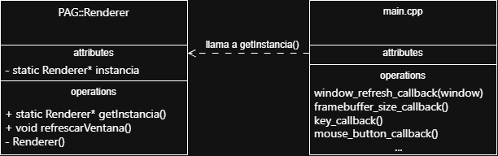

# pag-p1

Para conseguir que GLFW (escrita en C) llame a un método de la clase PAG::Renderer (C++)
debemos hacer el objeto Renderer accesible sin tener que pasarlo como parámetro.

Este objeto es único ya que solo es necesario tener un renderer para dibujar la pantalla.
Para ello usamos el patrón Singleton que garantiza: 

    1. La existencia de una única instancia de clase
    2. La forma de acceder a ella desde cualquier punto del programa mediante un método estático

Con este patrón declaramos el constructor de Renderer privado para que solo la propia clase pueda crear instancias de sí misma,
y un método estático público para obtenerla (la primera vez que se pide si es null, se crea, y las siguientes se usa la creada).

El encargado de crear la instancia por primera vez es el main(), quien arranca toda la aplicación.
Sin embargo debe hacerlo después de crear el contexto OpenGL ya que si no las llamadas a OpenGL no funcionarían.

Una vez declarado el objeto y este es accesible globalmente, usamos funciones puente. 
Estas son funciones que GLFW puede registrar como callback, cuya función es obtener la instancia del Renderer y aplicar el método correspondiente.
De esta forma, toda la lógica permanece encapsulada dentro de la clase.

